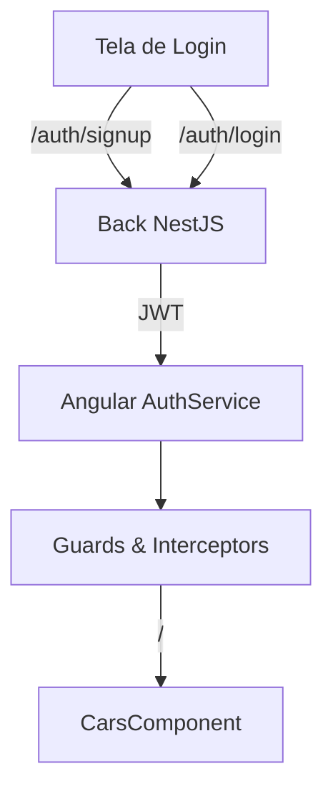

# Projeto: Carros App

Aplicação **Angular 18.2 (standalone)** para listagem e cadastro de carros.

---

## Índice
1. [Visão geral](#visão-geral)
2. [Arquitetura](#arquitetura)
3. [Pré‑requisitos](#pré-requisitos)
4. [Instalação e execução](#instalação-e-execução)
5. [Autenticação & Fluxo de Usuário](#autenticação--fluxo-de-usuário)
6. [Scripts úteis](#scripts-úteis)
7. [Estrutura de pastas](#estrutura-de-pastas)
8. [Contribuição](#contribuição)
9. [Licença](#licença)

---

## Visão geral
Este projeto demonstra um front‑end Angular standalone consumindo uma API REST em **Node.js + NestJS** com persistência no **Supabase**. O foco é a listagem de carros, mas todas as rotas são protegidas: _você precisa estar autenticado para visualizar qualquer carro_. Caso não possua conta, basta criar uma dentro do próprio app.

## Arquitetura
```
Angular 18.2 (standalone)
 └─► REST API (NestJS 10, Node 20)
      └─► Supabase Postgres (database + auth)
```

* **Angular**: lazy‑loaded routes e Signals.
* **NestJS**: módulos Cars, Auth e Users.
* **Supabase**: autenticação via JWT, Postgres + Storage.

## Pré‑requisitos
- Node >= 20
- npm >= 10 ou pnpm >= 9
- Conta gratuita no Supabase (caso deseje rodar o back localmente)

## Instalação e execução
```bash
# clone
$ git clone https://github.com/wendell-noce/car-location-frontend/

# front
$ cd apps/frontend
$ pnpm i               # ou npm install
$ ng serve            # standalone dev server

# back
$ cd ../../apps/backend
$ pnpm i
$ cp .env.example .env # configure SUPABASE_URL e SUPABASE_KEY
$ pnpm start:dev
```
A aplicação web fica disponível em `http://localhost:4200`.

## Autenticação & Fluxo de Usuário
1. **Login obrigatório**: ao acessar a rota `/`, o guard verifica o token JWT salvo em `sessionStorage`. Se ausente/expirado, o usuário é redirecionado para `/login`.
2. **Criar conta**: na tela de login há um link "Criar nova conta" que dispara a mutação `POST /auth/signup` (NestJS) → Supabase Auth.
3. **Sessão**: após login, o token é renovado a cada request via _interceptor_.



## Estrutura de pastas
```
apps/
  frontend/           # Angular standalone
    src/
      app/
        core/
        features/
        shared/

## Contribuição
Pull requests são bem‑vindos! Abra uma issue primeiro para discutir grandes mudanças.

## Licença
[MIT](LICENSE)
